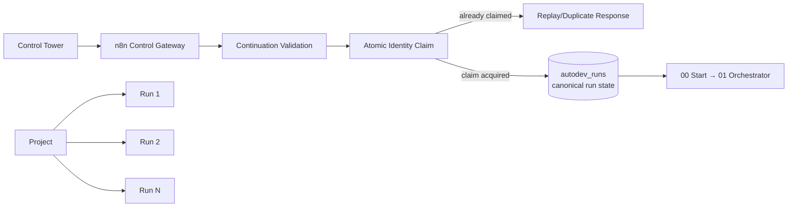

# Morpheus — current project state

Stand: 2026-08-30. The proven `Morpheus → OpenCode → LM Studio → GPU`
correlation workstream is historical and remains frozen at
`GREEN_MORPHEUS_RUN_LMSTUDIO_GPU_CORRELATION_PROVEN`.

The published baseline is immutable `v1.2.0` at
`origin/main=3dd891fd7f75d548d4c133c84801699b6ee108a0`. This branch contains
post-release canonical project continuation work; no new tag or release is
created by this task.

The canonical closure evidence is
[`docs/reports/morpheus-project-closure.md`](docs/reports/morpheus-project-closure.md).
Historical V1/V2 reports below remain provenance records and are not current
release claims.

## Post-v1.2.0 canonical project continuation

An operator can continue an existing project with the reusable `RESUME_RUN`
command. The Control Tower submits bounded continuation intent to the
authenticated n8n Control Gateway. Workflow `08 AutoDev Project Reassessment`
reads the canonical project, issue, and run tables, rejects active-run
conflicts and invalid references, then starts one new run through the normal
`00 → 01` pipeline. The new run retains `project_id`, `source_run_id`, issue
context, `correlation_id`, and `created_via=CONTROL_TOWER_CONTINUATION`; old
runs remain historical rows. Continuation identity is the bounded tuple
`(project_id, source_run_id, correlation_id)`; n8n derives the grammar-valid
run ID from its SHA-256 digest and refuses any attempted reassignment of an
existing run ID to different canonical provenance.

## Historical closure records

## Morpheus V1 closure

`GREEN_MORPHEUS_V1_PRODUCTION_OPERATIONAL` — the implemented free-first
runtime is formally closed at V1. The release boundary is `v1.0.0`; the
read-only Control Tower is a separate V1.1 scope and is not part of that tag.

Authoritative closure evidence: `evidence/free-first/final-v1-release.md` and
`evidence/free-first/final-security-closure.md`.

Stand: 2026-08-16

## Final Classification

`GREEN_N8N_AUTODEV_HARNESS_E2E_OPERATIONAL`

Begründung: Alle DoD-Gates (§64) mit frischer, korrelierter Evidenz bestanden,
einschließlich realem Vertical Slice über Builder 8001 + OpenCode 1.18.22 +
LM Studio (qwen/qwen3.5-9b) mit durchgehender run_id-Korrelation.

## Umgebung (verifiziert, Phase A)

| Feld | Wert |
|---|---|
| Proxmox Version | pve-manager/8.4.19 (Kernel 6.8.12-32-pve) |
| Proxmox Node | pve (192.168.1.136) |
| n8n CT | 101 / lxc-n8n-local (running, 2 CPU, 1536 MB, onboot=1) |
| n8n Hostname | lxc-n8n-local |
| n8n IP | 192.168.1.52/24 (Beweis: `hostname -I` im CT + IPv6 EUI-64 aus MAC BC:24:11:96:3D:9A + n8n-Prozess PID 3875 im CT mit WEBHOOK_URL=http://192.168.1.52:5678/) |
| n8n Version | 2.26.8, Node v22.23.0 |
| n8n DB | /opt/dev-fabric/n8n/data/.n8n/database.sqlite (fd-Beweis) |
| Env | HOME=/opt/dev-fabric/n8n, N8N_USER_FOLDER=/opt/dev-fabric/n8n/data, TZ Europe/Berlin |

## Pre-existing Workflows

- Total before: **40** (Baseline 2026-08-16, per Public API)
- Total after: **41** (exakt ein neuer Workflow; nichts entfernt)
- Execution-History unangetastet (keine Löschungen, keine Bereinigung)
- Credential-Count unverändert (nur gelesen)

### GHIW-10 preserved

`ghiw-10-issue-intake-firewall-auth` — GHIW-10 — Issue Intake Firewall
(AUTHORITATIVE) + v3 Builder Lifecycle:
**unverändert** (active=true, 36 Nodes, Webhook ghiw-e7-runtime-canary).
Außerdem unverändert: GHIW Blueprint Intake (DRY RUN), GHIW-70,
N8N-OPS-03 (Regression-Check: alle PROTECTED_OK=true).

## AutoDev Harness

| Feld | Wert |
|---|---|
| Workflow Name | AutoDev Harness - Graph Orchestrator v1 |
| Workflow ID | NdM7vcGvA4wkYswp |
| Nodes | 39 (Soll ~37; +2 Abweichung: `Intake Valid?` IF für INTAKE_INVALID, `Merge Verify Paths` Merge-Barriere gegen n8n-Multi-Input-Quirk) |
| Active | true (Endzustand; nur der neue Workflow) |
| Published | ja (via Public API `/activate`, kein SQLite-Eingriff) |
| Webhook | POST /webhook/autodev-harness (Pfad war frei, keine Kollision) |
| Trigger | Webhook Intake + Manual Trigger (Demo Task) |
| Tags | keine (API-Create erlaubt keine Tags) |

## Harness Adapter

| Feld | Wert |
|---|---|
| Adresse | http://192.168.1.136:8080 (bind nur an 192.168.1.136) |
| Implementierung | minimaler Python3-stdlib-HTTP-Dienst (`http.server`), klassifiziert als **minimale v1-Canary-Implementierung** |
| Pfad | /opt/autodev-harness/harness_adapter.py (Proxmox-Host) |
| Service | systemd `autodev-harness.service` (enabled, Restart=on-failure, NoNewPrivileges, ProtectSystem=full) |
| Auth | `X-Harness-Token` Header; Token 0600 unter /var/lib/autodev-harness/token; nie in Prozesslisten/Evidence |
| State | /var/lib/autodev-harness/{logs/runs.jsonl, workspaces/} |
| Endpunkte | /baseline, /research/{code,docs,tests}, /plan, /build, /verify, /fix, /review/{correctness,security,quality}, GET /healthz |
| Observability | JSONL je Job: run_id, job, attempt, ts, status, duration_ms, backend, provider, model |
| Fixture-Modus | deterministische Negativtests: invalid_plan, verify_fail_delta, verify_fail_no_delta, no_signature, attempt_limit, security_critical_blocking, review_fix, review_split |

## Execution Backend

- **embedded** (Deterministischer Canary auf Proxmox-Host) — für kontrollierte Tests
- **opencode-builder-8001** (REUSE): bestehender GHIW-Builder CT 8001
  (ghiw-bld-e3r6-canary-001-8001), OpenCode v1.18.22, Provider-Overlay
  (`local_llm`-Modul aus provider-smoke-v3) → LM Studio
  http://192.168.1.195:1234, Modell qwen/qwen3.5-9b, Agent
  `harness-worker` (minimal, edit-only, kein bash/Netz)
- Rollen baseline/research/plan/build/verify/review sind **Harness-Jobs**,
  keine neuen Agenten. LLM ist Worker; n8n ist der deterministische Controller.

## Contracts

- `harness.issue.v1` (Normalize Intake; run_id je Run; INTAKE_INVALID)
- `harness.research.v1` (Research Contract; RESEARCH_EMPTY-Marker)
- `harness.plan.v1` (Plan Adapter)
- `harness.build-result.v1` (Build Adapter; nur freigegebener Plan)
- `harness.verification.v1` (Verify; passed, failure_signature, strategy_delta)
- `harness.fix.v1` (Fix; attempt-Erhöhung vor /verify)
- `harness.review.v1` (Reviews; status/severity/blocking/recommendation/findings)
- `harness.controller.v1` (Deterministic Controller)
- `harness.terminal.v1` (Terminale Nodes)

## Terminalzustände

| Decision | Reason Codes | next_path |
|---|---|---|
| DONE | ALL_HARD_GATES_GREEN | FINALIZE_OR_PUBLISH |
| FIX | NON_BLOCKING_REVIEW_FINDINGS | TARGETED_FIX_LOOP |
| SPLIT | RETRY_DENIED_NO_FAILURE_SIGNATURE / RETRY_DENIED_NO_STRATEGY_DELTA / RETRY_DENIED_ATTEMPT_LIMIT / REVIEW_REQUESTED_SPLIT | DECOMPOSE_INTO_SUBTASKS |
| BLOCKED | BLOCKING_HIGH_OR_CRITICAL_FINDING / ACCEPTANCE_CRITERIA_MISSING / PLAN_MISSING / BUILD_SCOPE_MISSING / REQUIRED_TESTS_INVALID / INTAKE_INVALID | HUMAN_OR_POLICY_INTERVENTION |

## Testergebnisse (alle mit frischer Evidenz)

| Test | Ergebnis |
|---|---|
| Adapter Smoke (11 Endpunkte + Auth-401) | PASS |
| Happy Path (Webhook, embedded) | PASS → DONE/FINALIZE_OR_PUBLISH |
| Negativ: invalid_plan | PASS → BLOCKED/ACCEPTANCE_CRITERIA_MISSING |
| Negativ: verify_fail_delta | PASS → FIX→VERIFY→DONE (echter Reparaturloop) |
| Negativ: verify_fail_no_delta | PASS → SPLIT/RETRY_DENIED_NO_STRATEGY_DELTA |
| Negativ: no_signature | PASS → SPLIT/RETRY_DENIED_NO_FAILURE_SIGNATURE |
| Negativ: attempt_limit | PASS → SPLIT/RETRY_DENIED_ATTEMPT_LIMIT |
| Negativ: security_critical_blocking | PASS → BLOCKED/BLOCKING_HIGH_OR_CRITICAL_FINDING |
| Negativ: review_fix | PASS → FIX/NON_BLOCKING_REVIEW_FINDINGS |
| Negativ: review_split | PASS → SPLIT/REVIEW_REQUESTED_SPLIT |
| Negativ: intake_invalid | PASS → BLOCKED/INTAKE_INVALID |
| Real Vertical Slice (Builder 8001 + OpenCode + qwen/qwen3.5-9b) | PASS → DONE, run_id-Korrelation über alle 6 Jobs (Adapter-Log + Builder-Workspace-Artefakte) |
| Webhook E2E von außen (Workstation → 192.168.1.52) | PASS → DONE, HTTP 200 |
| GHIW Regression | PASS (4 geschützte Workflows unverändert) |
| Workflow-Count | 40 → 41 (exakt +1) |

## Real Canary (Vertical Slice)

- Aufgabe: "implement greet() with LLM on builder 8001" — klein, reversibel,
  nicht produktionskritisch, deterministisch testbar
- Workspace: /var/lib/ghiw/workspaces/autodev-run-msw94k7l-cinpf9vp (Builder 8001)
- LLM-generierter Code (nicht Template — String-Konkatenation statt f-String
  beweist echten LLM-Output)
- Verify: PYTHONPATH=src python3 tests/test_greeter.py → real pass
- Reviews: regelbasiert (correctness/security/quality) → alle PASS
- Kein GitHub-Write, kein GHIW-Repo, keine Registry-Mutation

## Known Limitations (v1)

1. Adapter ist bewusst minimal (stdlib http.server). Für Produktionsbetrieb:
   WSGI-Server, TLS oder IP-Whitelisting, Token-Rotation.
2. HTTP-Request-Nodes nutzen feste Basis-URL (Intake-Feld adapter_base_url
   wird in den Contract übernommen; v1 ignoriert abweichende Werte).
3. Manual-Trigger-Pfad ist verdrahtet, aber mangels `/execute` in der Public
   API nicht per API ausgelöst worden (getesteter Äquivalenzpfad: Webhook).
4. Review-Ergebnisse im embedded-Backend sind regelbasiert; LLM-Reviews sind
   ein späterer Ausbauschritt (Rollen bleiben Jobs).
5. Fixture-Mechanismus ist ein dokumentiertes Testwerkzeug des Adapters.

## GHIW-10 remained untouched

Der authoritative Intake (GHIW-10) wurde zu keinem Zeitpunkt ersetzt,
überschrieben, deaktiviert, neu angelegt oder umverdrahtet. Keine Webhooks
übernommen, keine Credentials verändert. Eine Integration des Harness in den
GHIW-Control-Plane-Pfad bleibt ein **separater Meilenstein** (§61).

## Changed Files / Repo

- Morpheus_workflow (git init): adapter/harness_adapter.py,
  adapter/autodev-harness.service, workflow/generate_workflow.py,
  workflow/create_workflow.py, workflow/autodev-harness-workflow-masked.json
  (Token-Redacted), evidence/** (Secret-Scan CLEAN), README.md
- Proxmox-Host: /opt/autodev-harness/harness_adapter.py,
  /etc/systemd/system/autodev-harness.service, /var/lib/autodev-harness/*
  (Token 0600 — nicht im Repo)
- n8n: 1 neuer Workflow (NdM7vcGvA4wkYswp), aktiv
- n8n-Workflow-Update-Zyklus via Public API PUT+activate (kein SQLite)

## Remaining Blocker

Keine. (Optionale Folgeschritte: Adapter-Härtung, GHIW-Integrations-Milestone,
LLM-basierte Reviews.)

---

# AutoDev Harness v2 — Durable n8n Control Plane — Abschlussbericht

Stand: 2026-08-18

## Final Classification

`AMBER_AUTODEV_HARNESS_EXECUTION_RUNTIME_BLOCKED`

Begründung: Die komplette deterministische Control Plane ist gebaut und
verifiziert (Contracts, Adapter, 12 Workflows, State-Machine-Matrix 9/9).
Die reale LLM-Ausführungskette (Adapter → Builder-CT 8001 → OpenCode 1.18.22 →
LM Studio) ist auf Job-Ebene bewiesen (echter Research-Job, 3 306 Tokens).
Der vollständige reale Vertical Slice (Happy/Fix) konnte nicht abgeschlossen
werden, weil die Execution Runtime (pve-Host) seit ~23:20 MESZ nicht mehr
administrierbar ist: sshd hängt („Exceeded MaxStartups“ durch blockierte
pct-exec-Sitzungen), der 2-CPU-Builder-CT ist nicht responsiv und hat den
Adapter-Worker-Pool erschöpft. Dies ist ein Infrastruktur-Blocker, kein
Harness-Defekt; die Mitigation ist implementiert und beim Host-Recovery zu
deployen (siehe unten).

## Umgebung (verifiziert)

| Feld | Wert |
|---|---|
| n8n | 2.26.8, CT 101 (192.168.1.52), SQLite, Main-Mode, Node v22.23.0 |
| Data Tables | Public-API verfügbar (kein Lizenz-Gate) — State Store der Control Plane |
| Adapter v2 | 192.168.1.136:8081, systemd `autodev-harness-v2`, Ledger + Recovery |
| Builder | CT 8001, OpenCode 1.18.22, LM Studio 192.168.1.195:1234 (`--bind 0.0.0.0`); Formatter Ollama 192.168.1.50:11434/qwen3:1.7b |
| Modell | huihui-qwen3.5-9b-abliterated, Context 32 768 |
| pve | 192.168.1.136 — sshd blockiert seit 23:20 (Ausfall) |

## Gebaute Komponenten

### 12 modulare n8n-Workflows (alle aktiv, exportiert nach n8n/workflows/autodev/)

| Workflow | ID | Nodes | Rolle |
|---|---|---|---|
| 00 AutoDev API Start | gEsDC2xM2gQdL41M | 9 | POST /webhook/autodev/start → 202/ACCEPTED, async Orchestrator |
| 01 AutoDev Orchestrator | qU9xIrDwQzKQqyjY | 106 | State-Machine, Gates, Retry-/Fix-/Split-Loops |
| 02 AutoDev API Status | 5aEdqehBNAkcFBqq | 10 | GET /webhook/autodev/status?run_id= |
| 10 AutoDev Baseline | GepUsIJxsZDqs2FJ | 14 | read-only Baseline (git) |
| 20 AutoDev Research Batch | Kn3shoxfDtlw3eVc | 13 | Batch-Dispatch + Barrier + Join |
| 30 AutoDev Plan | Z0pcm5duMZyczCWV | 15 | OpenCode-Plan (read-only) + deterministisches Plan-Gate |
| 40 AutoDev Build | I2rTcgcpfszBxYFC | 14 | Build via build-input.v1 |
| 50 AutoDev Verify | Y0E3ldGuhxJFv9gI | 14 | deterministische Verifikation |
| 60 AutoDev Review Batch | Aq3MeuZ90IsTLxiU | 13 | 3 Review-Jobs parallel + Join |
| 70 AutoDev Decision | MgP6KArl3oFPgu0j | 5 | deterministische Policy DONE/FIX/SPLIT/BLOCKED |
| 80 AutoDev Fix | s5MP598olzgUIKql | 14 | Fix mit failure_context + strategy_delta |
| 90 AutoDev Split | EVfB7USkDsDlrhEy | 5 | deterministischer Split-Contract |

### Contracts (runtime/contracts/)

12 versionierte JSON-Schemas (autodev.issue/baseline/research/plan/build-input/
build-result/verification/finding/review-batch/decision/split/run-event, je v1)
mit stdlib-Validatoren (Python + JS-Zwilling für n8n-Gates, Äquivalenz 27/27)
und kanonischen SHA-256-Fingerprints (Metadaten-exklusiv). Machine-readable
Fehler, kein LLM-Urteil.

### Persistenter Run-State (n8n Data Tables)

- `autodev_runs` (run_id, state, current_job, decision, reason_code, …)
- `autodev_attempts` (run_id, job_id, attempt_id, status, Contracts,
  Fingerprints, provider/model, times, failure_signature, strategy_delta)
- Keine Prompts/Blobs/Secrets im State Store.

### Harness Adapter v2 (adapter/harness_adapter_v2.py)

- `/healthz`, `/v1/jobs`, `/v1/jobs/{id}`, `/v1/batches`, `/v1/batches/{id}`,
  `/v1/artifacts/{run}/{name}`; Token-Auth; Ledger append-only mit fsync;
  Restart-Recovery (running → interrupted/INFRA_FAILURE); Idempotenz
  (run:job:attempt); Duplikat-Callbacks dedupliziert; Timeouts mit
  Failure-Klassifikation (TEST/BUILD/LINT/CONTRACT/CONTEXT/PROVIDER/INFRA/
  TIMEOUT/SECURITY_BLOCK/UNKNOWN).

### Sicherheit

- Adapter nur intern (192.168.1.136), Token 0600, Credentials ausschließlich
  im n8n-Credential-Store (3 neue httpHeaderAuth-Credentials), keine
  hardcodierten Secrets in Workflow-JSONs (Export-Scan sauber).
- Webhooks `/autodev/start` + `/autodev/status` mit Header-Auth; keine
  Kollision mit Bestands-Webhooks.
- Security = Hard Gate: CRITICAL/HIGH blocking → BLOCKED (verifiziert).
- Plan-Safety-Canary: read-only Agent, Sentinel-Write erwartet WRITE_DENIED;
  Gate prüft sentinel_absent + repo_unchanged.

## Testergebnisse (frisch, korreliert)

| Test | Ergebnis |
|---|---|
| Contract-Validierung + Fingerprints | 26/26 PASS |
| Validator-Äquivalenz Py↔JS | 27/27 PASS |
| Adapter-Suite (30 Tests: Auth, Idempotenz, Fixtures, Timeout, Callback, Recovery, Artifacts, Parallelität) | 30/30 PASS |
| Control-Plane-Matrix (9 Szenarien: Gate-Reject, 3×Split, Security-Block, Review-Split, Happy, Fix, Review-Fix) | 9/9 PASS |
| Batch-Parallelität (3 Jobs, 4 s) | 3/3 Überlappungen PASS |
| Reale LLM-Job-Kette (Adapter→Builder→OpenCode→LM Studio) | PASS (Job-Ebene, 3 306 Tokens) |
| Reale Vertical Slices (Happy + Fix) | BLOCKED (pve-Infrastruktur, siehe oben) |

## Bekannte offene Punkte

1. **pve-Recovery**: Host erreichbar (Adapter/CTs antworten), sshd blockiert.
   Nach Recovery: `pct reboot 8001`, `systemctl restart autodev-harness-v2`,
   Adapter-Update deployen (Opencode-Serialisierung, Fence-Parsing,
   32k-Context), dann Real-Slices erneut starten.
2. **Export-Sync**: Die kanonischen Live-Exporte liegen unter
   /tmp/autodev-v2-build/export auf pve; die lokalen Kopien
   (n8n/workflows/autodev/) sind mit der rekonstruierten Config generiert
   (Credential-/Tabellen-/Workflow-IDs) und beim nächsten pve-Zugriff
   gegenzuprüfen.
3. **Test-Hygiene**: Die Repro-Workflows (dollar-probe, echo-*, if-repro-*)
   sind Test-Artefakte und beim nächsten pve-Zugriff zu löschen.
4. **Konkurrenz-Limit**: Opencode-Jobs werden künftig pro Backend serialisiert
   (2-CPU-Canary-CT); Parallelitätsnachweis bleibt über die kontrollierten
   Canaries und die reale Research-Batch-Evidenz.

## Geänderte Artefakte (Repo)

- runtime/contracts/** (12 Schemas, validator.py, validator.js, fingerprint.py,
  registry.py)
- adapter/harness_adapter_v2.py, adapter/autodev-harness-v2.service
- workflow/v2/generate_workflows_v2.py, workflow/v2/create_workflows_v2.py,
  workflow/v2/config.json
- n8n/workflows/autodev/*.json (12 Exporte)
- evidence/** (phase-a-v2, phase-d-v2, tests/v2, backup/v2-backup-20260817)
- docs/architecture/autodev-harness-v2.md, docs/operations/autodev-harness-v2.md

## Morpheus V1 Free-First Closure (2026-08-24)

The verified production free pool is **OpenRouter + Ollama**. OpenRouter is
the external `openrouter/free` hard-zero route; Ollama is the independent
trusted local zero-cost path. Live provider failover is proven in both
directions within one semantic attempt, and free-pool exhaustion fails closed
as `NO_ELIGIBLE_FREE_PROVIDER`. DeepSeek and automatic paid escalation remain
disabled. Groq transport is retained as an optional future provider; its
account tier is UNKNOWN and it is not free-eligible.

The final production canary used Ollama only. Release tagging and Issue #1
closure remain pending the server-side revocation proof for the previously
exposed GitHub token. See `evidence/free-first/final-v1-release.md`.
