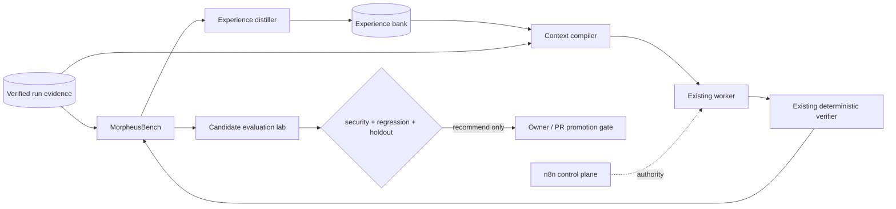

# Adaptive Harness Architecture

Morpheus adds an offline adaptive layer around the existing n8n control plane.
n8n remains the sole control plane and `autodev_runs` remains canonical run
state. Benchmark, context and experience stores are evidence/read models only.

The adaptive layer can propose and test one bounded component delta. It cannot
change authorization, holdout membership, paid-routing policy, DeepSeek policy,
verifier authority, or production state.
