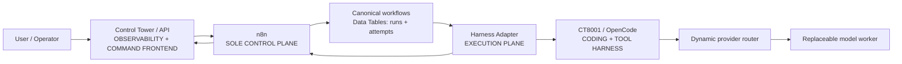
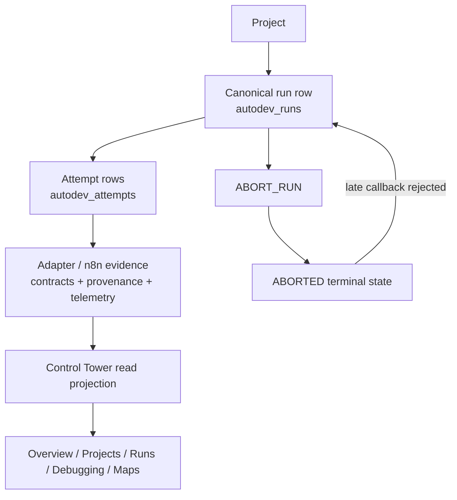
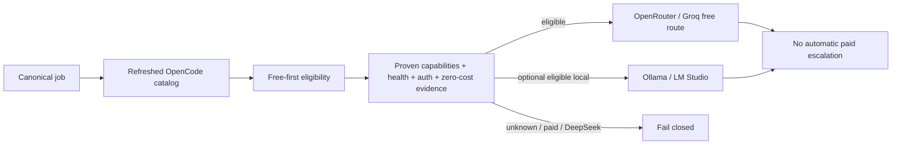

# Morpheus project closure and release gate

Audit date: 2026-08-30
Scope: repository state after `MORPHEUS_RUN_LMSTUDIO_GPU_CORRELATION`
Classification: `AMBER_MORPHEUS_RELEASE_READY_WITH_NONBLOCKING_DEBT`

The correlation workstream is closed. This report is the current closure
record; older files under `evidence/` remain historical evidence and are not
rewritten.

## 1. Reality refresh and release history

```text
START_MAIN= db0f9d000cf096e4d02e6ed2e915f03e612e1a81
ORIGIN_MAIN= db0f9d000cf096e4d02e6ed2e915f03e612e1a81
AUDIT_TREE= identical to origin/main before closure documentation changes
WORKTREE_AT_REFRESH= clean
OPEN_PRS= 0
OPEN_ISSUES= 1 (#10)
LATEST_TAG= v1.1.2
LATEST_TAG_COMMIT= 16977b47683ff7d6db5a8e51be19752a34b909e0
GITHUB_RELEASES= none
COMMITS_SINCE_LATEST_TAG= 72
```

The checked-out branch initially pointed to the pre-merge PR #55 commit
`d175399…`; its tree was identical to `origin/main`. The closure branch was
then based directly on `origin/main`. No tag was moved and no release was
published.

The repository convention is the `vMAJOR.MINOR.PATCH` tag sequence
`v1.0.0 → v1.1.0 → v1.1.1 → v1.1.2`. The next candidate is `v1.2.0`: changes
since `v1.1.2` add project-centric Control Center behavior, runtime telemetry,
allow-listed operator command contracts, and the completed correlation
capability. This is a semantic minor release, not an arbitrary increment.

Current version references are intentional after closure alignment:

- Control Tower service build: `1.2.0`.
- Latest published Morpheus tag: `v1.1.2`.
- Proposed candidate: `v1.2.0`.
- Core V1 release: `v1.0.0`.
- Historical evidence mentioning V1.1.2 remains labelled historical.

## 2. Current architecture and production topology

The control-plane ownership is unchanged:



There is no browser-to-provider, browser-to-Proxmox, arbitrary-SSH, or
Dashboard-owned retry/state path. `autodev_runs` and `autodev_attempts` in
n8n Data Tables remain canonical. The Adapter ledger is execution telemetry,
not a second run-state authority.

The deployed topology observed by read-only probes is:

| Component | Location | Current evidence |
|---|---|---|
| Control Tower | `192.168.1.136:8092` | `/healthz` HTTP 200, version `1.2.0` |
| Harness Adapter v2 | `192.168.1.136:8081` | `/healthz` HTTP 200, version `2.0.0`, 0 running jobs |
| Harness Adapter v1 | `192.168.1.136:8080` | `/healthz` HTTP 200 |
| n8n | `192.168.1.52:5678` | `/healthz` HTTP 200 |
| OpenCode | CT8001 | proven by supplied acceptance run; no new model request issued |
| Proxmox / GPU telemetry | private LAN | proven by supplied acceptance run; read-only paths |
| LM Studio | optional local provider | proven by supplied acceptance run; not required for canonical health |

The public static dashboard assets (`index.html`, `app.js`, `styles.css`, and
the pinned Mermaid runtime) hash-identically to the deployed assets at the
start of this audit. The closure PR changes only the free-route alert text;
deployment was intentionally not performed, so the deployed service remains
on its pre-closure asset tree until the PR is merged and separately deployed.
A full authenticated Control Tower projection was not queried because the
workspace does not contain a viewer token.

## 3. Data flow, project model, routing, and telemetry



The project-to-run-to-attempt relationship is represented by canonical n8n
rows. Terminal `ABORTED` is authoritative; late callbacks cannot resurrect
the run, as covered by the workflow tests and the supplied acceptance run.



Unknown models fail closed. API providers need authentication and pricing
evidence; trusted local endpoints receive explicit local zero-cost evidence.
DeepSeek is ineligible, and paid fallback is disabled. The proven local model
classification remains:

```text
MODEL=llama-3.2-1b-instruct@q4_k_m
RESEARCH=true PLAN=false BUILD=false TOOL=false
```

The UI’s Mermaid topology and data-flow definitions are version-controlled in
`dashboard/static/app.js`; runtime values only select known static nodes and
are inserted as text. Mermaid is local, pinned, and hash-recorded in
`dashboard/static/vendor/mermaid/README.md`.

## 4. Closed correlation baseline

```text
BASELINE_COMMIT=db0f9d000cf096e4d02e6ed2e915f03e612e1a81
BASELINE_CLASSIFICATION=GREEN_MORPHEUS_RUN_LMSTUDIO_GPU_CORRELATION_PROVEN
ROUTING=GREEN
OPENCODE_LMSTUDIO_PATH=GREEN
LOCAL_ZERO_COST_EVIDENCE=GREEN
GPU_OFFLOAD=GREEN
CONTROL_CENTER_LIVE_CORRELATION=GREEN
ACTIVE_TO_IDLE_TRANSITION=GREEN
BROWSER_QA=GREEN in supplied acceptance evidence
SECURITY_GATES=GREEN
```

Acceptance evidence supplied for `run-mte031d2-tiioi7` records terminal
`ABORTED`, nonempty abort response, no late resurrection, no direct Data Table
edit, zero paid requests, and zero DeepSeek requests. The following are
frozen unless a new reproducible regression appears: model validation,
OpenCode/LM Studio seam, local auth separation, trusted zero-cost evidence,
catalog reconciliation, local health, Adapter lifecycle, Control Tower
execution-context projection, research correlation, GPU process recognition,
LM Studio ACTIVE→IDLE telemetry, and terminal abort behavior.

## 5. Gate results

| Gate | Result | Evidence |
|---|---|---|
| Repository clean | OK | clean at refresh; closure changes are scoped |
| Root tests | OK | `pytest -q`: 125 passed, 0 failed, 0 skipped |
| Dashboard / Control Tower tests | OK | 68 passed |
| Runtime / Adapter / Router tests | OK | 53 passed; targeted router/security subsets also pass |
| Script tests | OK | 4 passed |
| Contract tests | OK | `python3 runtime/tests/test_contracts.py`: 34/34 |
| Validator equivalence | OK | `python3 runtime/tests/test_validator_equivalence.py`: 34/34 |
| Workflow tests | OK | 6 passed; generated canonical workflows validate |
| Python compile check | OK | `python3 -m compileall -q adapter dashboard runtime scripts workflow evidence/tests` |
| Node check | OK | all repository JavaScript excluding pinned vendor bundle |
| Diff check | OK | `git diff --check` |
| Architecture sentinel | OK | builder dashboard boundary, read-only telemetry, and workflow ownership tests |
| Documentation / Mermaid gate | OK after closure alignment | current spec, operations docs, and report mirror implementation |
| Security tests / secret scan | OK | targeted security tests pass; tracked-file scan found no secret values |
| Governance gate | OK with follow-up | no open PRs; Issue #10 is implemented but still open |

The fresh browser script was attempted against the live service at all five
configured viewport sizes. It could not pass authentication because no viewer
token is available in this workspace; it therefore remains
`BLOCKIERT_EXTERN`, not a claimed fresh GREEN result. The latest checked-in
visual evidence records four-view QA PASS, and deployed static assets match
the audited tree.

## 6. Security closure

```text
N8N_SOLE_CONTROL_PLANE=true
SECOND_SOR=false
RUNTIME_DASHBOARD_WRITES=0
DEEPSEEK_ALLOWED=false
AUTOMATIC_PAID_ESCALATION=false
BROWSER_HAS_INFRA_SECRETS=false
PRIVATE_COT_STORAGE=false
REASONING_CONTENT_REDACTION=PASS
STRICT_HOST_KEY_CHECKING=PASS
GPU_READ_ONLY=true
PROXMOX_READ_ONLY=true
SECRET_SCAN=PASS
```

The repository contains only credential-handling code and sanitized evidence
references under names that mention credentials; no key, token, bearer value,
private key, or password value is committed. Values were not printed.

## 7. Open work and debt

### Release blockers

None found in implementation, contracts, routing policy, security boundaries,
or production health probes. Publication remains withheld because the fresh
authenticated browser proof could not be rerun here and release publication
requires owner authorization.

### Important, non-blocking

- Repeat browser QA with a valid viewer token and attach fresh evidence.
- Perform a read-only authenticated check of the deployed n8n command gateway
  and operator/admin credential wiring; no mutating command was sent during
  this audit.
- Close or update GitHub Issue #10 under normal project policy. Its map
  acceptance criteria are implemented by PR #11 and the later correlation
  work in PR #55; the original five-item navigation wording was superseded by
  the current eight-view Control Center navigation.
- Keep the many merged remote feature branches as provenance until the
  repository owner chooses a branch-retention policy; none was deleted.

### Optional enhancements

- Adapter production hardening (stronger HTTP serving, TLS/IP policy, token
  rotation) already listed as a V1 limitation.
- Repeatable authenticated browser-QA tooling in release automation.
- LLM-backed reviews after a separate capability and governance decision.

### Historical / stale material

Older V1/V2 closure reports, DeepSeek HAMH research, backups, screenshots, and
early release-lineage notes remain historical artifacts. They are not current
runtime policy and should not be used to reopen the closed LM Studio workstream.

## 8. Open PR / issue triage

```text
OPEN_PRS=0
OPEN_ISSUES=1
ISSUE_10=DONE (implemented; left open for owner-controlled closure)
```

No PR is open for the frozen workstream, and PR #56 was not started. The
implementation provenance is issue #10 → PR #11 (maps) → PR #42 (project
Control Center) → PRs #54/#55 (live correlation) → current tests and supplied
acceptance run.

## 9. Release decision and publication boundary

```text
RELEASE_DECISION=AMBER_RELEASE_READY_WITH_NONBLOCKING_DEBT
CURRENT_RELEASE=v1.1.2
PROPOSED_NEXT_RELEASE=v1.2.0
RELEASE_PUBLICATION_READY=false
RELEASE_TAG_PROPOSED=v1.2.0
RELEASE_COMMIT=afd84ff471d2dbc93a51ca19f3e36aa62e20960f
```

No Git tag, GitHub Release, or release artifact was created. The candidate
needs fresh authenticated browser evidence and owner authorization before
publication. The closure-only documentation PR is the only change proposed
by this audit.

## 10. Next milestone

### 1. Canonical project continuation and command-gateway operational proof

`WHY_NOW=` The Control Center’s project model and allow-listed command
contract are implemented, while the deployed command path and continuation
evidence remain the clearest operational gap.
`USER_VALUE=` Complete project-to-issue-to-run operation from the Morpheus
Control Center with durable n8n ownership.
`DEPENDENCIES=` Authenticated n8n command gateway, project/issue Data Tables,
operator/admin credentials, and read-only then controlled mutation acceptance
tests.
`RISKS=` Accidental second control plane or unbounded command surface if the
n8n contract is not kept strict.
`ESTIMATED_SCOPE=MEDIUM`
`RECOMMENDED=YES`

### 2. Adapter operational hardening and recovery runbook

`WHY_NOW=` The execution boundary is proven but documented V1 limitations
remain around serving hardening, rotation, and operator recovery.
`USER_VALUE=` More predictable service recovery and lower operational risk.
`DEPENDENCIES=` Deployment owner decision on TLS/IP policy, rotation process,
and recovery drill environment.
`RISKS=` Infrastructure changes can affect the frozen execution path.
`ESTIMATED_SCOPE=MEDIUM`
`RECOMMENDED=NO`

### 3. Deterministic release-evidence automation

`WHY_NOW=` Release confidence currently depends on manually supplied browser
credentials and historical visual evidence.
`USER_VALUE=` Repeatable closure reports with fresh browser, health, and
provenance evidence.
`DEPENDENCIES=` Safe secret injection for viewer QA, repository CI policy, and
an explicit release publication workflow.
`RISKS=` Automation must remain read-only until owner-authorized publication;
it must not create a second source of truth.
`ESTIMATED_SCOPE=SMALL`
`RECOMMENDED=NO`

```text
NEXT_RECOMMENDED_MILESTONE=Canonical project continuation and command-gateway operational proof
KNOWN_BLOCKERS=none in implementation; fresh browser evidence is externally blocked
USER_ACTION_REQUIRED=provide a valid Control Tower viewer token for fresh browser QA; authorize release publication separately if desired
```
